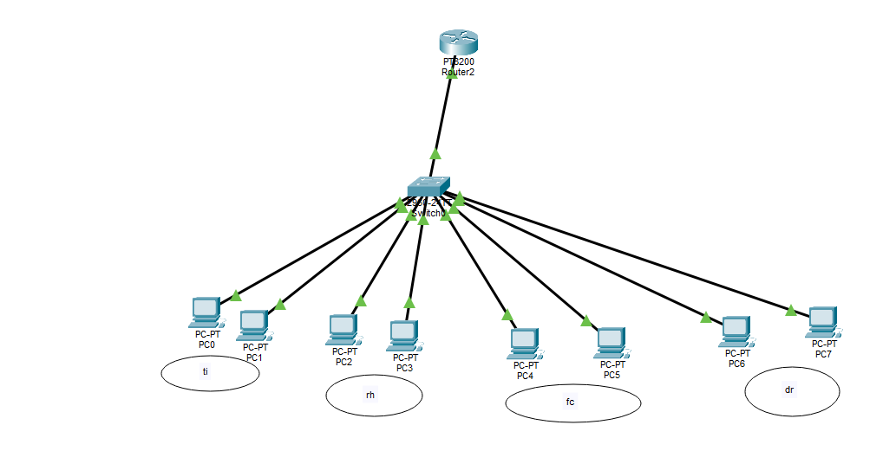

# Laboratório de VLAN com Cisco Packet Tracer

Laboratório prático desenvolvido para estudar e demonstrar conceitos de redes utilizando Cisco Packet Tracer.

## 🎯 Objetivo

Criar uma rede segmentada utilizando VLANs e permitir a comunicação entre diferentes redes através de roteamento inter-VLAN.

## 🖥️ Tecnologias e conceitos

- Cisco Packet Tracer
- Cisco IOS
- VLAN
- Access Port
- Trunk 802.1Q
- Router-on-a-Stick
- IPv4
- Gateway
- Inter-VLAN Routing
- Testes de conectividade com Ping

## 🌐 VLANs utilizadas

| VLAN | Nome | Rede | Gateway |
|---|---|---|---|
| 10 | TI | 192.168.10.0/24 | 192.168.10.1 |
| 20 | RH | 192.168.20.0/24 | 192.168.20.1 |
| 30 | Financeiro | 192.168.30.0/24 | 192.168.30.1 |
| 40 | Diretoria | 192.168.40.0/24 | 192.168.40.1 |

## 🔀 Topologia


```text
                  ROTEADOR
                     |
                   TRUNK
                  802.1Q
                     |
                  SWITCH
        ┌────────┬────────┬────────┐
       VLAN 10  VLAN 20  VLAN 30  VLAN 40
         TI       RH      FIN.    DIRETORIA
        PC PC    PC PC    PC PC     PC PC
